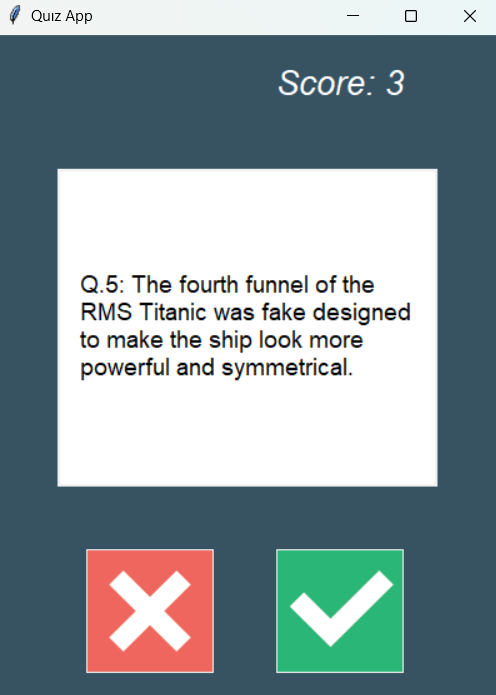

# Trivia Quiz App



The Trivia Quiz App is a dynamic and engaging quiz application designed to test your knowledge on a wide range of topics. With the integration of a Trivia Questions API, this app offers a fun and educational way to challenge yourself and others.

## Features

- **Trivia Questions**: Access an extensive library of trivia questions from various categories.
- **Educational and Fun**: Learn new facts while having fun with the quiz challenges.
- **API Integration**: Powered by a Trivia Questions API for a diverse question pool.

## Prerequisites

Before running the Trivia Quiz App, make sure you have the following prerequisites:

- **Python**: The app was developed using Python 3.11+.

### Installation

1. Clone or download this repository to your local machine:

   ```bash
   git clone https://github.com/makifcevik/trivia-quiz-app.git
   cd trivia-quiz-app
